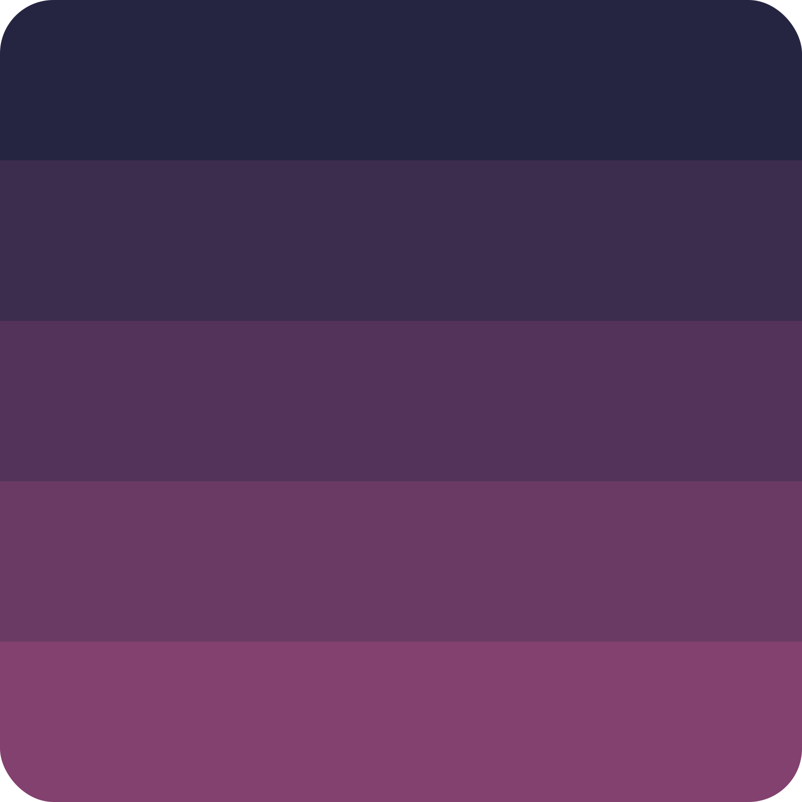

  
  <h1 align="center">Endless Gradients</h1>
  
A sample project using Ethereal Color Library

  

    
    
    
    
  

  

    
  

## What is?

A small example project using the Ethereal Color library, [you can check it out here](https://alexrintt.github.io/endless-gradients)

## Library

To learn more about the library, [visit the repository](https://github.com/alexrintt/ethereal-color)

 
 
 
 

<samp>

<h2 align="center">
  Open Source
</h2>

  Copyright © 2020-present, Alex Rintt.

Endless Gradients <a href="https://github.com/alexrintt/endless-gradients/blob/master/LICENSE.md">is MIT licensed 💖</a>

  

</samp>
